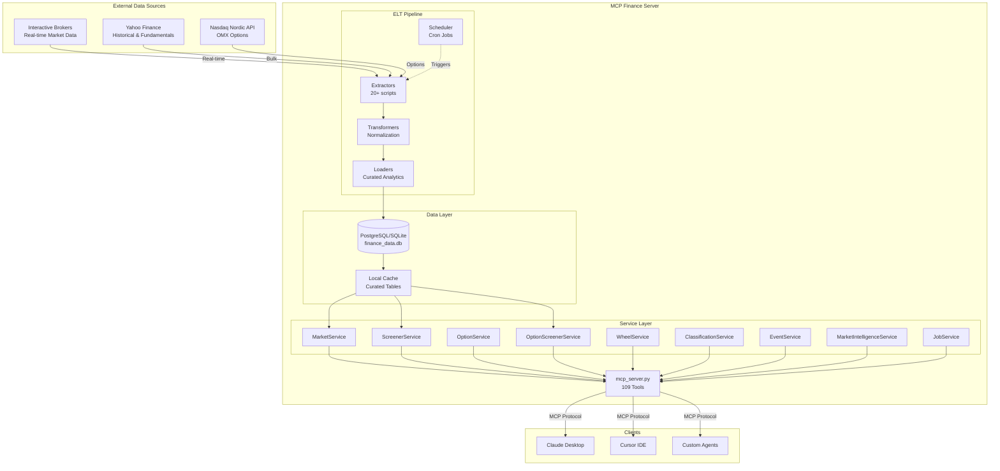

# MCP Finance Server - Architecture

## Overview

MCP Finance Server é um servidor MCP (Model Context Protocol) especializado em análise financeira, com foco em mercados nórdicos (Suécia), Brasil e EUA. O sistema combina dados em tempo real (IBKR), dados históricos (Yahoo Finance) e um pipeline ELT local para fornecer análises confiáveis e rápidas.

**Filosofia de Design:**
- **LLM-First**: APIs desenhadas para serem facilmente interpretadas por LLMs
- **Cache-First**: Prioriza dados locais curados sobre chamadas diretas a APIs externas
- **Determinístico**: Respostas previsíveis com envelopes padronizados
- **Wheel-Centric**: Ferramentas especializadas para estratégia Wheel (venda de puts/calls)

---

## System Architecture



---

## Core Components

### 1. MCP Server (`mcp_server.py`)

**Responsabilidade:** Registro e exposição de 109 ferramentas via protocolo MCP.

**Principais Funcionalidades:**
- Tool registration com decoradores `@mcp.tool()` e `@tool_endpoint()`
- Normalização de respostas (envelope padrão)
- Circuit breaker por fonte de dados (IBKR/Yahoo/Local)
- Métricas de observabilidade (latência, falhas, source breakdown)
- Capability discovery (`get_market_capabilities()`)

**Padrões:**
```python
@mcp.tool()
@tool_endpoint(source="local_db")
async def get_stock_price(symbol: str) -> Dict[str, Any]:
    # Envelope padronizado:
    return {
        "success": True,
        "data": {...},
        "meta": {
            "source": "local_db",
            "asof": "2026-02-17T12:00:00Z",
            "request_id": "uuid"
        }
    }
```

---

### 2. Service Layer

#### **MarketService** (`services/market_service.py`)
- **Propósito:** Resolução de símbolos e preços em tempo real
- **Fontes:** IBKR (primário), Local DB (fallback)
- **Principais Métodos:**
  - `get_stock_price()`: Preço atual
  - `get_historical_data()`: OHLCV histórico
  - `search_symbol()`: Busca fuzzy de tickers

#### **ScreenerService** (`services/screener_service.py`)
- **Propósito:** Rankings e filtros de ações
- **Fonte:** Local DB (`stock_metrics`, `market_movers`)
- **Principais Métodos:**
  - `get_stock_screener()`: Filtro genérico
  - `get_top_gainers/losers()`: Rankings de performance
  - `get_technical_signals()`: RSI, MACD, Bollinger

#### **OptionService** (`services/option_service.py`)
- **Propósito:** Option chains e Greeks via IBKR
- **Fonte:** IBKR (real-time)
- **Principais Métodos:**
  - `get_option_chain()`: Cadeia completa
  - `get_option_greeks()`: Delta, Gamma, Theta, Vega, IV

#### **OptionScreenerService** (`services/option_screener_service.py`)
- **Propósito:** Filtros de opções em cache local
- **Fonte:** Local DB (`option_metrics`)
- **Principais Métodos:**
  - `get_option_screener()`: Filtro por delta/IV/liquidez
  - `get_option_chain_snapshot()`: Snapshot completo

#### **WheelService** (`services/wheel_service.py`)
- **Propósito:** Análises completas para estratégia Wheel
- **Fonte:** Combinação (Options + Market + Local)
- **Principais Métodos:**
  - `get_wheel_put_candidates()`: Seleção de puts
  - `analyze_wheel_put_risk()`: Análise de risco
  - `get_wheel_contract_capacity()`: Capacidade de capital
  - `compare_wheel_start_timing()`: Timing de entrada

#### **ClassificationService** (`services/classification_service.py`)
- **Propósito:** Taxonomia de setores e perfis de empresas
- **Fonte:** Local DB (`sector_taxonomy`, `company_profiles`)
- **Principais Métodos:**
  - `get_companies_by_sector()`: Filtro por setor/indústria
  - `get_company_core_business()`: Descrição do negócio

#### **EventService** (`services/event_service.py`)
- **Propósito:** Calendário unificado de eventos
- **Fonte:** Local DB (`market_events`)
- **Principais Métodos:**
  - `get_event_calendar()`: Eventos gerais
  - `get_corporate_events()`: Earnings, dividendos
  - `get_macro_events()`: CPI, GDP, etc.

#### **MarketIntelligenceService** (`services/market_intelligence_service.py`)
- **Propósito:** Cache local de news, holders, recomendações
- **Fonte:** Local DB (`stock_intelligence_snapshots`)
- **Principais Métodos:**
  - `get_news()`: Notícias recentes
  - `get_institutional_holders()`: Holders institucionais
  - `get_analyst_recommendations()`: Recomendações de analistas

#### **JobService** (`services/job_service.py`)
- **Propósito:** Controle do pipeline ELT
- **Fonte:** Local DB (`jobs`, `job_runs`)
- **Principais Métodos:**
  - `list_jobs()`: Lista de jobs
  - `trigger_job()`: Disparo manual
  - `get_job_logs()`: Logs de execução

---

### 3. Data Layer

#### **Database Schema** (`dataloader/models.py`)

**Tabelas Core:**
- `stocks`: Registro de ações
- `realtime_prices`: Preços em tempo real
- `historical_prices`: OHLCV histórico
- `fundamentals`: P/E, Market Cap, etc.
- `dividends`: Histórico de dividendos

**Tabelas de Analytics:**
- `stock_metrics`: RSI, MACD, volatilidade, performance
- `market_movers`: Top gainers/losers/active
- `option_metrics`: Greeks e quotes de opções
- `option_iv_snapshots`: Histórico de IV

**Tabelas de Taxonomia:**
- `sector_taxonomy`: Setores normalizados
- `industry_taxonomy`: Indústrias
- `subindustry_taxonomy`: Sub-indústrias
- `company_profiles`: Perfis enriquecidos

**Tabelas de Eventos:**
- `market_events`: Calendário unificado
- `earnings_events`: Earnings curados
- `stock_intelligence_snapshots`: Cache de news/holders/recs

**Tabelas Raw (ELT Extract Layer):**
- `raw_yahoo_prices`, `raw_yahoo_fundamentals`
- `raw_ibkr_prices`, `raw_ibkr_contracts`
- `raw_ibkr_option_params`, `raw_ibkr_option_chains`

---

### 4. ELT Pipeline

#### **Extract Scripts** (`dataloader/scripts/extract_*.py`)
- `extract_yahoo_prices.py`: Preços do Yahoo (1 min)
- `extract_yahoo_fundamentals.py`: Fundamentos (diário)
- `extract_ibkr_prices.py`: Preços IBKR (2 min)
- `extract_ibkr_instruments.py`: Contratos IBKR (6h)
- `extract_option_metrics.py`: Greeks e quotes (15-30 min)
- `extract_nasdaq_options.py`: Opções OMX via Nasdaq (5 min)

#### **Transform Scripts** (`dataloader/scripts/transform_*.py`)
- `transform_prices.py`: Normaliza preços raw
- `transform_fundamentals.py`: Normaliza fundamentos
- `normalize_classifications.py`: Taxonomia de setores

#### **Load Scripts** (`dataloader/scripts/load_*.py`)
- `load_stocks_*.py`: Carrega listas de ações (B3, OMX, US)
- `load_historical_prices.py`: Backfill de histórico (5y)
- `load_event_calendar.py`: Gera calendário de eventos
- `load_market_intelligence.py`: Cache de news/holders/recs

#### **Compute Scripts** (`dataloader/scripts/calculate_*.py`)
- `calculate_stock_metrics.py`: RSI, MACD, volatilidade
- `update_market_movers.py`: Top gainers/losers
- `snapshot_option_iv.py`: Snapshots de IV

#### **Scheduler** (`dataloader/scheduler.py`)
- **Modelo:** Single-worker queue (serial execution)
- **Deduplicação:** Mesmo job não roda em paralelo
- **Recovery:** Orphan runs são marcados como `failed` no startup
- **Triggers:** Cron + Manual (via MCP ou UI)

---

## Data Flow Examples

### Example 1: Get Top Gainers (Sweden)

```
User Query: "Quais são as maiores altas hoje na Suécia?"
    ↓
MCP Tool: get_top_gainers(market='sweden', period='1D', limit=10)
    ↓
ScreenerService.get_top_gainers()
    ↓
Query: SELECT * FROM market_movers WHERE market='OMX' AND category='top_gainers'
    ↓
Response: {success: true, data: [...], meta: {source: 'local_db', asof: '...'}}
```

**Data Freshness:**
- `market_movers` atualizado pelo job "Update Market Movers" (a cada 5 min)
- Fonte upstream: `stock_metrics` (calculado a cada 5 min)
- Fonte upstream: `realtime_prices` (atualizado a cada 1 min via Yahoo)

---

### Example 2: Wheel Put Selection (Nordea)

```
User Query: "Qual PUT vender esta semana em Nordea com risco moderado?"
    ↓
MCP Tool: get_wheel_put_candidates(symbol='Nordea', delta_min=0.25, delta_max=0.35, dte_min=4, dte_max=10)
    ↓
WheelService.get_wheel_put_candidates()
    ↓
1. Resolve symbol: 'Nordea' → 'NDA-SE.ST'
2. Query option_metrics: WHERE stock_id=X AND right='PUT' AND delta BETWEEN 0.25 AND 0.35
3. Filter by DTE: expiry BETWEEN today+4 AND today+10
4. Calculate annualized return: (premium/strike) * (365/DTE)
5. Rank by return
    ↓
Response: {success: true, data: [{strike: 120, premium: 2.5, return_annualized: 15.2%, ...}]}
```

**Data Freshness:**
- `option_metrics` atualizado pelo job "Extract Option Metrics - OMX" (a cada hora)
- Fonte upstream: IBKR (real-time Greeks) ou Nasdaq Nordic (Bid/Ask)

---

## Tool Catalog (109 Tools)

### Market Data (8 tools)
| Tool | Description | Source | Ambiguity Risk |
|------|-------------|--------|----------------|
| `get_stock_price` | Preço atual | Local DB | ❌ Clear |
| `get_historical_data` | OHLCV histórico (IBKR) | IBKR | ⚠️ Overlap com `get_historical_data_cached` |
| `get_historical_data_cached` | OHLCV histórico (Yahoo) | Local DB | ⚠️ Overlap com `get_historical_data` |
| `search_symbol` | Busca fuzzy de tickers | Local DB | ❌ Clear |
| `get_exchange_info` | Info de exchange | Local DB | ❌ Clear |
| `yahoo_search` | Busca Yahoo | Yahoo API | ⚠️ Overlap com `search_symbol` |
| `get_sector_performance` | Performance por setor | Yahoo API | ❌ Clear |
| `query_local_stocks` | Query genérica de ações | Local DB | ⚠️ Redundante com screener |

### Fundamentals (6 tools)
| Tool | Description | Source | Ambiguity Risk |
|------|-------------|--------|----------------|
| `get_fundamentals` | P/E, Market Cap, etc. | Local DB | ❌ Clear |
| `get_dividends` | Dividendos atuais | Local DB | ⚠️ Overlap com `get_dividend_history` |
| `get_dividend_history` | Histórico de dividendos | Local DB | ⚠️ Overlap com `get_dividends` |
| `get_company_info` | Perfil da empresa | Local DB | ⚠️ Overlap com `get_comprehensive_stock_info` |
| `get_financial_statements` | Balanços | Local DB | ❌ Clear |
| `get_comprehensive_stock_info` | Tudo junto | Local DB | ⚠️ Mega-tool (anti-pattern) |
| `query_local_fundamentals` | Query genérica | Local DB | ⚠️ Redundante |

### Screener (11 tools)
| Tool | Description | Source | Ambiguity Risk |
|------|-------------|--------|----------------|
| `get_stock_screener` | Filtro genérico | Local DB | ❌ Clear |
| `get_top_gainers` | Maiores altas | Local DB | ❌ Clear |
| `get_top_losers` | Maiores baixas | Local DB | ❌ Clear |
| `get_most_active_stocks` | Mais negociadas | Local DB | ❌ Clear |
| `get_top_dividend_payers` | Maiores dividendos | Local DB | ❌ Clear |
| `get_technical_signals` | Sinais técnicos | Local DB | ❌ Clear |
| `get_highest_rsi` | RSI mais alto | Local DB | ⚠️ Redundante com `get_technical_signals` |
| `get_lowest_rsi` | RSI mais baixo | Local DB | ⚠️ Redundante com `get_technical_signals` |
| `get_fundamental_rankings` | Rankings por métrica | Local DB | ⚠️ Overlap com `get_stock_screener` |

### Options (5 tools)
| Tool | Description | Source | Ambiguity Risk |
|------|-------------|--------|----------------|
| `get_option_chain` | Cadeia completa | Local DB | ❌ Clear |
| `get_option_greeks` | Greeks específicos | IBKR | ⚠️ Overlap com `get_option_chain_snapshot` |
| `get_option_screener` | Filtro de opções | Local DB | ❌ Clear |
| `get_option_chain_snapshot` | Snapshot completo | Local DB | ⚠️ Overlap com `get_option_chain` |
| `get_options_data` | Dados de opções | IBKR | ⚠️ Redundante com `get_option_chain` |

### Wheel Strategy (12 tools)
| Tool | Description | Source | Ambiguity Risk |
|------|-------------|--------|----------------|
| `get_wheel_put_candidates` | Seleção de puts | Computed | ❌ Clear |
| `get_wheel_put_annualized_return` | Retorno anualizado | Computed | ⚠️ Redundante (já em `put_candidates`) |
| `get_wheel_contract_capacity` | Capacidade de capital | Computed | ❌ Clear |
| `analyze_wheel_put_risk` | Análise de risco | Computed | ❌ Clear |
| `get_wheel_assignment_plan` | Plano de assignment | Computed | ❌ Clear |
| `get_wheel_covered_call_candidates` | Seleção de calls | Computed | ❌ Clear |
| `compare_wheel_premiums` | Comparação de prêmios | Computed | ⚠️ Redundante (usar screener) |
| `evaluate_wheel_iv` | Análise de IV | Computed | ❌ Clear |
| `simulate_wheel_drawdown` | Simulação de drawdown | Computed | ❌ Clear |
| `compare_wheel_start_timing` | Timing de entrada | Computed | ❌ Clear |
| `build_wheel_multi_stock_plan` | Plano multi-ação | Computed | ❌ Clear |
| `stress_test_wheel_portfolio` | Stress test | Computed | ❌ Clear |

### Classification & Earnings (3 tools)
| Tool | Description | Source | Ambiguity Risk |
|------|-------------|--------|----------------|
| `get_companies_by_sector` | Filtro por setor | Local DB | ❌ Clear |
| `get_company_core_business` | Descrição do negócio | Local DB | ❌ Clear |
| `get_earnings_events` | Eventos de earnings | Local DB | ❌ Clear |
| `get_earnings_history` | Histórico de earnings | Local DB | ⚠️ Overlap com `get_earnings_events` |
| `get_earnings_calendar` | Calendário de earnings | Local DB | ⚠️ Overlap com `get_earnings_events` |

### Market Intelligence (5 tools)
| Tool | Description | Source | Ambiguity Risk |
|------|-------------|--------|----------------|
| `get_news` | Notícias recentes | Local DB | ❌ Clear |
| `get_institutional_holders` | Holders institucionais | Local DB | ❌ Clear |
| `get_analyst_recommendations` | Recomendações | Local DB | ❌ Clear |
| `get_technical_analysis` | Análise técnica | Local DB | ⚠️ Overlap com `get_technical_signals` |

### Events (7 tools)
| Tool | Description | Source | Ambiguity Risk |
|------|-------------|--------|----------------|
| `get_event_calendar` | Calendário geral | Local DB | ❌ Clear |
| `get_corporate_events` | Eventos corporativos | Local DB | ❌ Clear |
| `get_macro_events` | Eventos macro | Local DB | ❌ Clear |
| `get_monetary_policy_events` | Política monetária | Local DB | ❌ Clear |
| `get_geopolitical_events` | Eventos geopolíticos | Local DB | ❌ Clear |
| `get_market_structure_events` | Estrutura de mercado | Local DB | ❌ Clear |
| `get_wheel_event_risk_window` | Janela de risco Wheel | Local DB | ❌ Clear |

---

---

## Simplification Proposal

### Issues Identified

**1. Overlapping Tools (Ambiguidade para LLMs)**
- `get_historical_data` vs `get_historical_data_cached`
- `get_dividends` vs `get_dividend_history`
- `get_company_info` vs `get_comprehensive_stock_info`
- `get_option_chain` vs `get_option_chain_snapshot` vs `get_options_data`
- `get_earnings_events` vs `get_earnings_history` vs `get_earnings_calendar`
- `search_symbol` vs `yahoo_search`
- `get_highest_rsi` vs `get_lowest_rsi` (redundante com `get_technical_signals`)

**2. Mega-Tools (Anti-Pattern)**
- `get_comprehensive_stock_info`: Retorna tudo (price + fundamentals + dividends + news)
  - **Problema:** LLM não sabe quando usar vs tools específicos
  - **Solução:** Deprecar e usar composição de tools específicos

**3. Redundant Query Tools**
- `query_local_stocks`, `query_local_fundamentals`
  - **Problema:** Genéricos demais, overlap com screener
  - **Solução:** Remover e usar screener

**4. Inconsistent Naming**
- `get_wheel_put_annualized_return` já está em `get_wheel_put_candidates`
- `compare_wheel_premiums` é redundante com `get_option_screener`

---

### Proposed Simplification (77 → 55 tools)

#### **Merge/Remove (22 tools)**

**Market Data:**
- ❌ Remove `get_historical_data` → Use `get_historical_data_cached` (rename to `get_historical_data`)
- ❌ Remove `yahoo_search` → Use `search_symbol`
- ❌ Remove `query_local_stocks` → Use `get_stock_screener`

**Fundamentals:**
- ❌ Remove `get_dividends` → Use `get_dividend_history` (rename to `get_dividends`)
- ❌ Remove `get_company_info` → Use `get_comprehensive_stock_info` (rename to `get_company_info`)
- ❌ Remove `query_local_fundamentals` → Use `get_fundamentals`

**Screener:**
- ❌ Remove `get_highest_rsi` → Use `get_technical_signals(signal_type='overbought')`
- ❌ Remove `get_lowest_rsi` → Use `get_technical_signals(signal_type='oversold')`
- ❌ Remove `get_fundamental_rankings` → Use `get_stock_screener(sort_by=metric)`

**Options:**
- ❌ Remove `get_option_chain_snapshot` → Merge into `get_option_chain`
- ❌ Remove `get_options_data` → Use `get_option_chain`
- ❌ Remove `get_option_greeks` → Use `get_option_screener` (com filtros específicos)

**Wheel:**
- ❌ Remove `get_wheel_put_annualized_return` → Já em `get_wheel_put_candidates`
- ❌ Remove `compare_wheel_premiums` → Use `get_option_screener`

**Earnings:**
- ❌ Remove `get_earnings_history` → Use `get_earnings_events(upcoming_only=False)`
- ❌ Remove `get_earnings_calendar` → Use `get_earnings_events(upcoming_only=True)`

**Intelligence:**
- ❌ Remove `get_technical_analysis` → Use `get_technical_signals`

**Introspection:**
- ❌ Remove `help_tool` → Use `describe_tool`

---

### Renamed Tools (Clarity)

| Old Name | New Name | Reason |
|----------|----------|--------|
| `get_historical_data_cached` | `get_historical_data` | Único método histórico |
| `get_dividend_history` | `get_dividends` | Mais intuitivo |
| `get_comprehensive_stock_info` | `get_company_info` | Mais claro |
| `get_option_chain` | `get_option_chain` | Mantém (absorve snapshot) |

---

### New Tool Descriptions (LLM-Friendly)

**Before:**
```python
@mcp.tool()
async def get_historical_data(symbol: str, duration='1 D', bar_size='1 hour'):
    """Get historical OHLCV data from IBKR."""
```

**After:**
```python
@mcp.tool()
async def get_historical_data(symbol: str, period='1y', interval='1d'):
    """
    Get historical OHLCV data (Open, High, Low, Close, Volume).
    
    Use this for: price charts, technical analysis, backtesting.
    
    Parameters:
        symbol: Stock ticker (e.g., 'AAPL', 'NDA-SE.ST')
        period: Time range ('1d', '1w', '1m', '3m', '1y', '5y')
        interval: Bar size ('1m', '5m', '1h', '1d')
    
    Returns: List of OHLCV bars with timestamps.
    
    Example: get_historical_data('AAPL', period='1m', interval='1d')
    """
```

---

## Implementation Roadmap

### Phase 1: Documentation (Current)
- [x] Create `ARCHITECTURE.md`
- [ ] Create `METHOD_SIMPLIFICATION.md` (detailed proposal)
- [ ] Update `README.md` with simplified catalog

### Phase 2: Deprecation Warnings
- [ ] Add deprecation warnings to redundant tools
- [ ] Update tool descriptions with migration paths
- [ ] Log usage metrics for deprecated tools

### Phase 3: Migration
- [ ] Implement merged tools
- [ ] Update service layer
- [ ] Update tests

### Phase 4: Removal
- [ ] Remove deprecated tools
- [ ] Update client examples
- [ ] Bump major version

---

## Best Practices for Adding New Tools

1. **Intent-Specific:** One tool = one clear intent
2. **Avoid Overlaps:** Check existing tools before adding
3. **LLM-Friendly Names:** Use verb + noun pattern (`get_`, `analyze_`, `compare_`)
4. **Explicit Defaults:** Always provide safe defaults (e.g., `market='sweden'`)
5. **Stable Envelopes:** Use standard response format
6. **Examples in Docstring:** Include 1-2 concrete examples
7. **Source Annotation:** Use `@tool_endpoint(source="...")` decorator

---

## Observability

### Metrics Available
- **Tool-level:** Calls, failures, avg latency
- **Source-level:** IBKR, Yahoo, Local DB breakdown
- **Circuit Breaker:** Open/closed state per source
- **Job-level:** Success rate, duration, last run

### Health Checks
- `GET /health`: System health
- `GET /metrics`: Prometheus-compatible metrics
- `get_server_health()`: MCP tool
- `get_server_metrics()`: MCP tool

---

## Security Model

**Read-Only by Design:**
- ❌ No order placement
- ❌ No position modification
- ❌ No fund transfers
- ✅ Analytics only
- ✅ Account inspection (masked by default)
- ✅ Pipeline control (admin-only)

**Protection Layers:**
- API key for admin endpoints (`DATALOADER_API_KEY`)
- Tool allowlist (`MCP_TOOL_ALLOWLIST`)
- Masked account summary by default
- CORS configuration
- Rate limiting (circuit breaker)

---

## References

- [MCP Protocol Spec](https://modelcontextprotocol.io)
- [Interactive Brokers API](https://interactivebrokers.github.io/tws-api/)
- [Yahoo Finance API](https://github.com/ranaroussi/yfinance)
- [Nasdaq Nordic API](https://api.nasdaq.com/api/nordic/)
